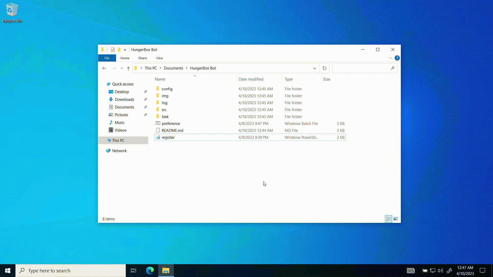
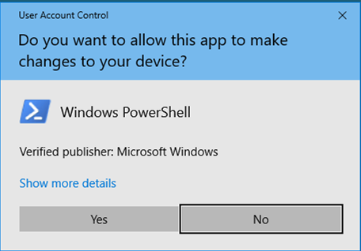

# HungerBox Bot <!-- omit in toc -->

HungerBox Bot is a simple Python script to automate the monotonous task of pre-booking breakfast and lunch. This bot completely takes care of pre-booking your food so that you enjoy your meal.

## Table of Contents <!-- omit in toc -->

- [Working](#working)
- [Installation](#installation)
  - [Pre-requisites](#pre-requisites)
  - [Procedure](#procedure)
- [Features](#features)
  1. [Disabling the Bot](#1-disabling-the-bot)
  2. [Enabling the Bot](#2-enabling-the-bot)
  3. [Modifying the Preferences](#3-modifying-the-preferences)

## Working

The bot uses the *Selenium* and *Chromium Web Driver* packages to access the HungerBox website to pre-book your meal.

First, the user runs the `preferences.bat` once, where the bot collects the required details. After that, the user runs `register.ps1`, which will register a task with `Windows Task Scheduler` to schedule run `bot.bat` at 06:05 PM IST from Sunday to Thursday.

## Installation

This section will take you through the step-by-step process of deploying this bot.

### Pre-requisites

1. Windows Computer
2. [Google Chrome](https://www.google.com/intl/en_in/chrome/)
3. [Python](https://www.python.org/ftp/python/3.11.3/python-3.11.3-amd64.exe) (Version 3.9 or greater)

If you don't have Python pre-installed, click the above link to install it.

### Procedure

1. Download the repository and unzip the file to a location where the files will not be deleted (Recommended: 'C/Users/\<username\>/Documents')

2. Run the `preference.bat` file and provide details like email ID, password, dietary choices and meals required.

3. After that, run `register.ps1` file with PowerShell and click Yes when prompted, as shown below.

Now, the bot is all set and will pre-book your meal.

## Features

### 1. Disabling the Bot

You can disable the bot by running `disable.ps1` file with PowerShell located in *task* folder, like shown above, when you are going for a vacation or working from home.

### 2. Enabling the Bot

You can enable the bot by running `enable.ps1` file with PowerShell located in *task* folder.

### 3. Modifying the Preferences

Later, if you wish to modify the preferences, or if you have changed your login credentials, you can run `preference.bat` file again to update the details.
